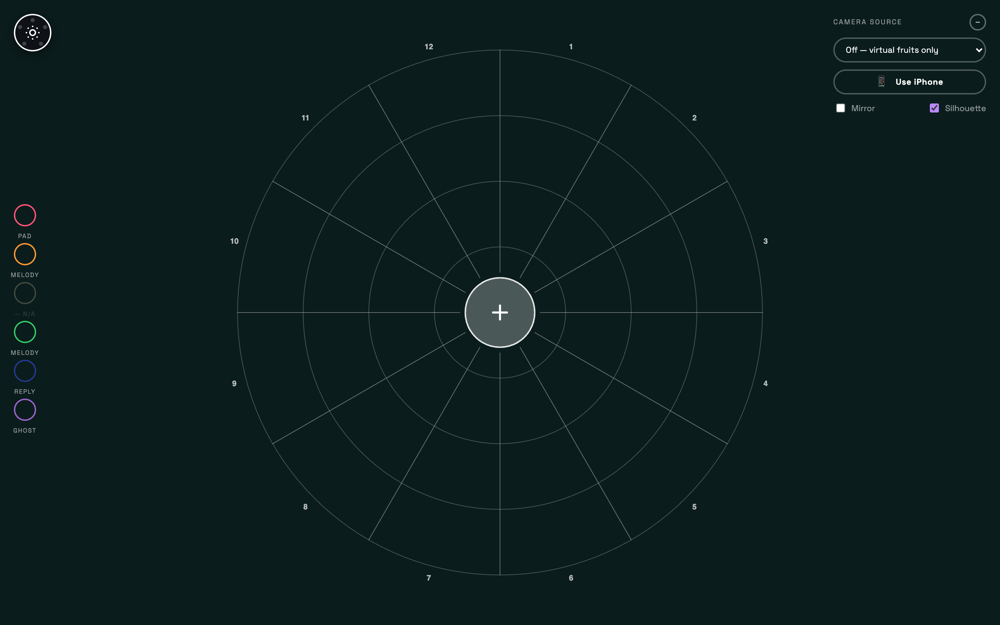
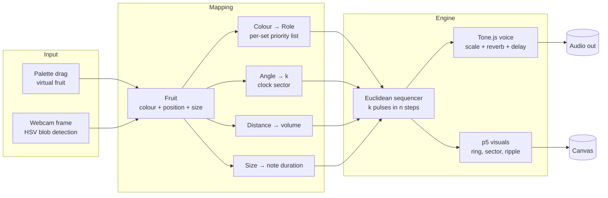
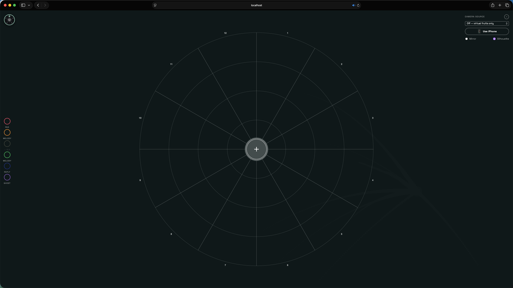
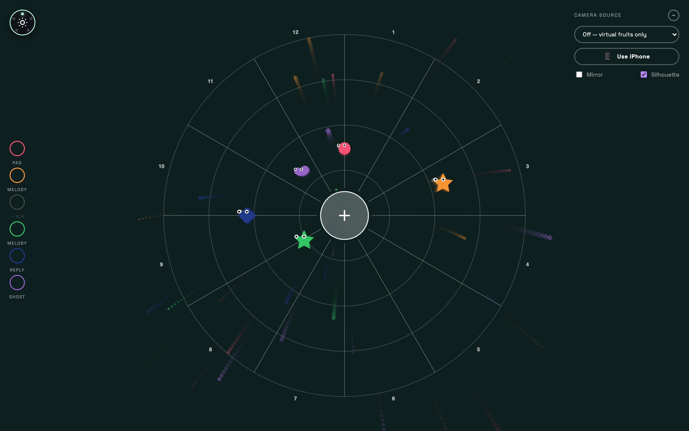
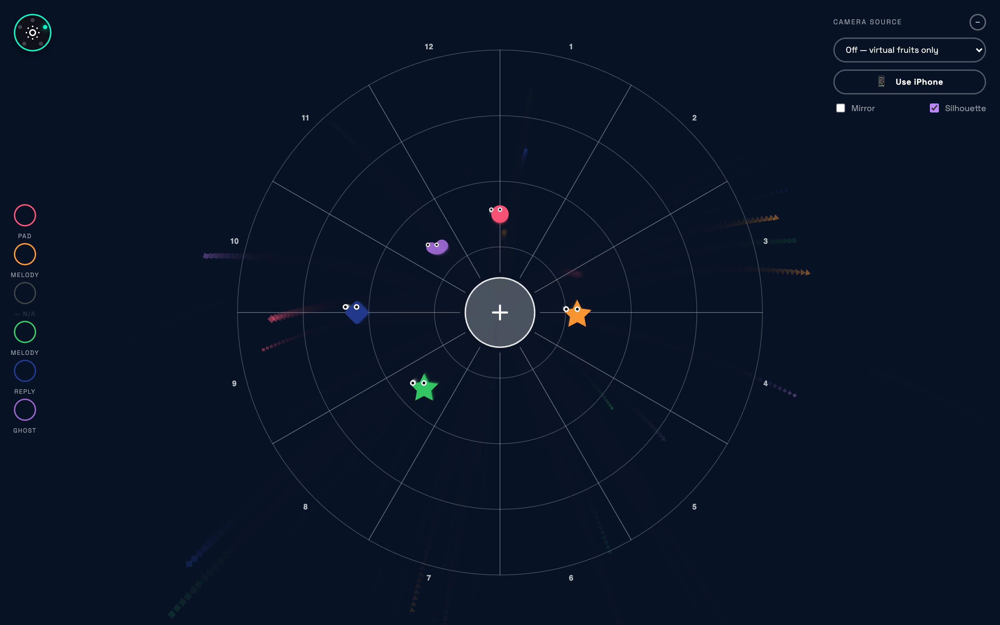
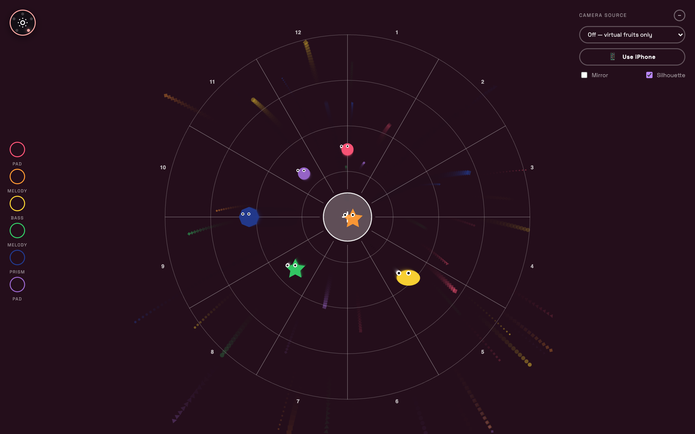
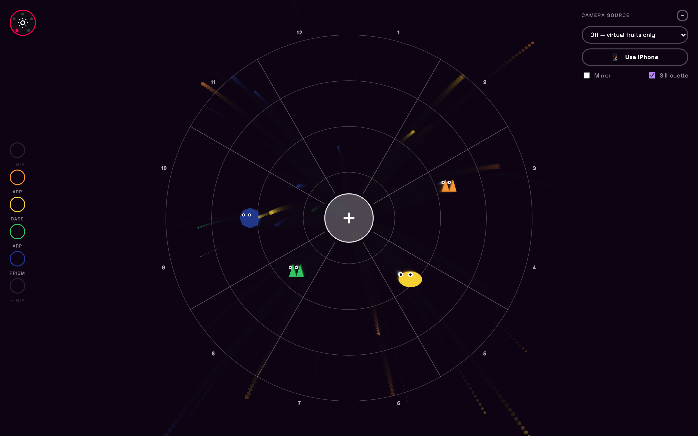
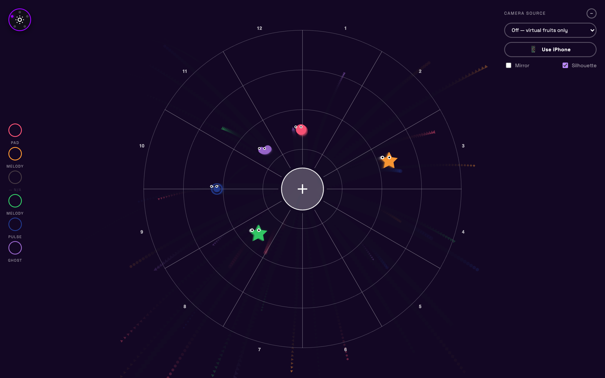

# NoteBlock — Audiovisual Playground

**Author:** _Your Name_
**Contact:** _your.email@example.com_



## Abstract

NoteBlock is a browser-based audiovisual instrument built with p5.js and Tone.js. The screen becomes a clock-faced "table" onto which the player drops virtual fruits — each colour is a voice, each fruit is a looping Euclidean rhythm. Position controls loudness and rhythmic count, size controls note duration, and an optional camera input lets real, physical fruits trigger the same voices in real time. The result is a tactile, generative composition that sits between a step sequencer, a synth pad, and a tabletop game.

## Detailed Explanation / Artist Statement

Most software instruments ask you to think in tracks, grids, and parameters. NoteBlock asks you to think in objects on a table. Drag a strawberry close to the centre and it gets louder. Push a blueberry to the edge of the clock and its rhythm thins out. Swap musical worlds — Mist, Aria, Bloom, Drop, Afterglow — and the same fruits speak with new voices.

Five curated **sets** define the musical universe. Each set picks a scale, a tempo, a palette of available instruments (pads, melodic leads, basses, percussion, glitchy textures), and the global feel of the reverb and delay. The same gesture — placing a green fruit — therefore plays a soft melodic note in *Mist* and a punchy kick in *Drop*.

Every fruit is a **Euclidean sequencer**: a pattern of `k` pulses spread as evenly as possible across `n` steps. Where you place the fruit on the clock face decides `k`; the icon panel lets you change `n`. Distance from the centre is mapped to volume, so the table itself is your mixer — pulling a fruit outward is a physical fade.

The optional **camera mode** turns the laptop's webcam (or an iPhone via Continuity Camera) into a colour-tracking surface. Hold up real fruit, foam shapes, or coloured paper and NoteBlock segments the frame in HSV space, finds connected colour blobs, and spawns short-lived "voices" that follow each blob across the table. The same musical rules apply — the system doesn't care whether the strawberry is a real one or a virtual one. The intent is to dissolve the boundary between digital instrument and physical play, and to invite collaborators (including non-musicians and children) into the work without a controller, a MIDI device, or a tutorial.

The visual layer — concentric loudness rings, the lit clock sector, ripple bursts on each note, the stepping indicator orbiting each fruit — is not decoration. It is the score being read aloud, and it gives the player feedback about *why* a sound just happened, so they can learn the instrument by playing it.

## How It Works (Signal Flow)



## Camera Interaction

The camera view turns the clock table into an augmented performance surface. With the camera off, the work behaves like a virtual fruit sequencer. With the camera on, the live video feed appears inside the playable circle and detected fruit colours become animated musical voices.

### Camera Off



### Camera On, Empty Table


### Camera On, Fruits Detected


### Camera On, Fruits Mapped To Notes


## The Five Modes

Each mode is a complete musical world: scale, tempo, instrument roster, filter and effects character. Switch modes with the dial button in the top-left.

### Mist · `bpm 63`

Whispered E major pentatonic, deep reverb, almost no percussion. Pads, melody, reply, ghost.



### Aria · `bpm 84`

A natural minor with a rim-shot pulse and bright reply melodies. Pads, melody, reply, rim, ghost, snare.



### Bloom · `bpm 110`

Major-pentatonic-leaning, fast arpeggios and prismatic bell tones over a steady bass. Melody, arp, bloom, prism, hat, rim, bass, pad.



### Drop · `bpm 150`

A purely rhythmic set: kick, snare, hats, sub-bass, arp, prism and pulse. Almost no reverb, short delay tail. The "club" mode.



### Afterglow · `bpm 72`

A long, drifting C major ambient set. Pads, ghosts, soft pulses, rounded reply leads.



## Project Structure

```text
.
├── index.html                  # App shell and DOM markup
├── src/
│   ├── scripts/app.js          # p5, Tone, camera, and interaction logic
│   └── styles/main.css         # Visual styling for the UI and canvas overlays
├── canvas/audiovisual_playground.html
│                               # Earlier standalone canvas version kept as reference
└── docs/screenshots/           # README images
```

## Installation

The project has **no build step and no npm dependencies** — p5.js and Tone.js are loaded from a CDN in `index.html`. You only need:

- A modern desktop browser (Chrome, Edge, Safari, or Firefox; Chromium-based browsers are recommended for the camera mode).
- Python 3 (or any other static file server) to serve the project locally so the browser will allow `getUserMedia` and module-style script loading.

Clone the repository:

```sh
git clone https://github.com/RyanYu0410/NoteBlock.git
cd NoteBlock
```

## Execution

Start a static server from the project root:

```sh
python3 -m http.server 5173
```

Then open [http://localhost:5173](http://localhost:5173) in your browser.

Other equivalent options if you prefer:

```sh
npx serve .          # Node
php -S 0.0.0.0:5173  # PHP
```

The first interaction (a click or key press) will unlock the Web Audio context — this is a browser requirement.

### Using the instrument

- **Drag a fruit** from the bottom palette onto the table to add a voice.
- **Drag a fruit on the table** to move it; distance from the centre = volume, angular position = pulse count `k`.
- **Click a fruit** to select it; the icon panel lets you change its size (note duration) and pattern length `n`.
- **Cycle musical sets** with the mode button (top-left dial icon).
- **Camera mode:** open the camera panel (top-right), pick a webcam, or click *Use iPhone* for Continuity Camera. Hold up coloured objects (fruit works best — the colour mapping was tuned against real fruit) and they will appear as live voices on the table. Tick *Mirror* if the image feels reversed; tick *Silhouette* to overlay a faint outline of the camera image.

## Display

NoteBlock is designed to be shown on a single screen, fullscreen, in a darkened room with stereo speakers or headphones.

Recommended exhibition setup:

- A laptop or mini-PC running Chrome in **fullscreen** (`F11` / `⌃⌘F`).
- A **1080p+ display** in landscape orientation (the layout reflows, but the clock face is most legible above ~1280×800).
- **Stereo speakers** or quality headphones — the reverb tails and panning carry a lot of the piece.
- For the camera version: a **top-down or front-facing webcam** (or an iPhone on a tripod via Continuity Camera) pointed at a neutral, well-lit surface where visitors can place coloured objects. A small bowl of real fruit on a white tablecloth works well.
- Disable the OS screensaver and auto-sleep for the duration of the show.

A live web build is also published via GitHub Pages at the repository's Pages URL, if you only want to point a browser at a hosted version.
